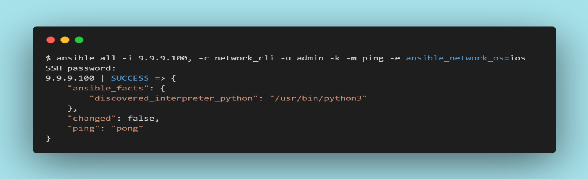
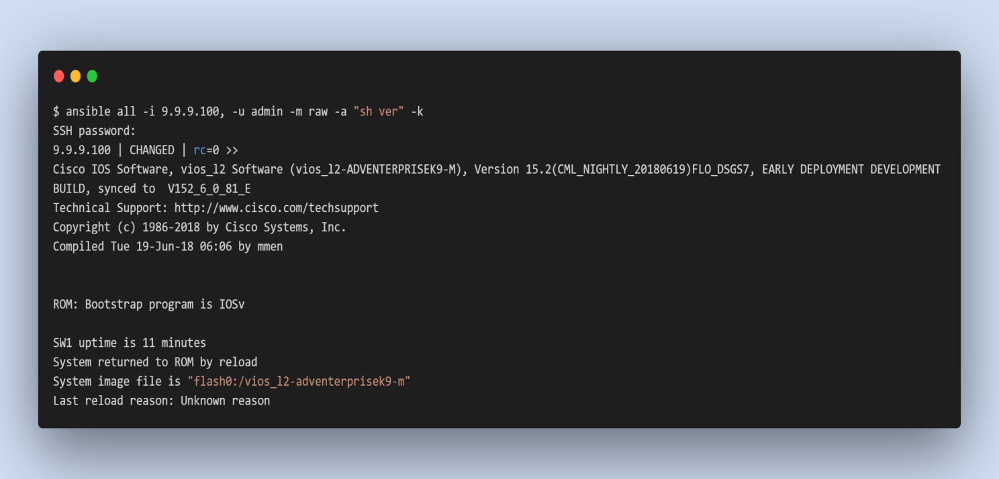
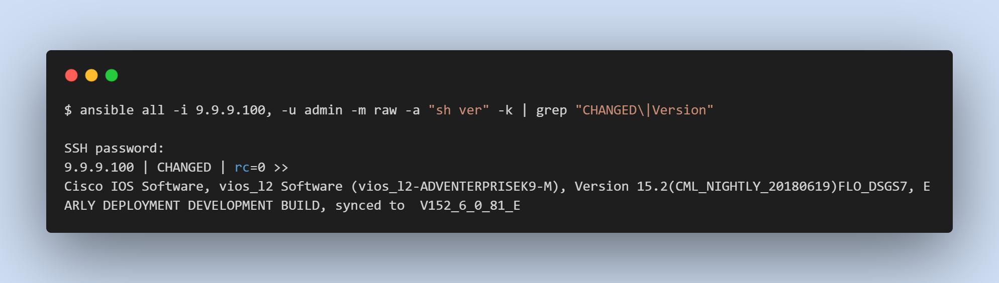
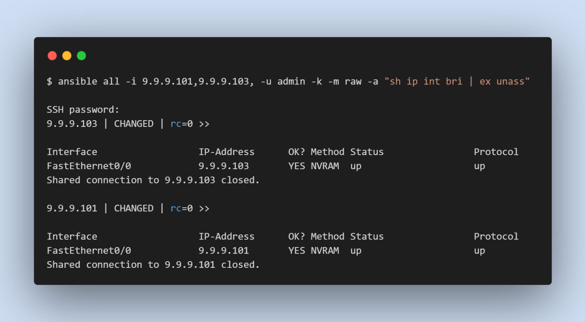

# Ansible Installation

Ansible handles communication between control nodes and managed nodes through multiple protocols:

- network_cli by SSH
- netconf by SSH
- httpapi by HTTP/HTTPS

Ansible can be installed on most Unix/Linux systems, with the only dependency being Python3.5 or higher. Currently, the Windows operating system is not officially supported as the control machine.

For installation, you can use the Ansible [website](https://docs.ansible.com/ansible/2.9/installation_guide/index.html), which supports various kinds of platforms. We will be installing Ansible on the WSL (Ubuntu) machine.

```console
sudo apt update
sudo apt-get install software-properties-common
sudo apt-add-repository ppa:ansible/ansible
sudo apt-get install ansible
```

Ansible is updated once every six months, so it's best to install it in a virtual environment.

```console
sudo apt install virtualenv
virtualenv ansible-lab
source ansible-lab/bin/activate
pip install ansible==2.9.27
```

Stop the virtual environment with the `deactivate` command.

Install Ansible using your preferred method. See [Installing Ansible](https://docs.ansible.com/ansible/2.9/installation_guide/intro_installation.html#installation-guide). Now we can check our managed node with the Ad-hoc command.

## Ansible Ad-hoc Command

An Ansible Ad-hoc command uses the /usr/bin/ansible command-line tool to automate a single task on one or more managed nodes. Ad-hoc commands are quick and easy, but they are not reusable.

To run an Ad-hoc command or Ansible playbook it is mandatory to establish a manual SSH connection to the managed nodes to confirm your credentials and retrieve its configuration. This manual connection also establishes the authenticity of the network device, adding its RSA key fingerprint to your list of known hosts.

Instead of manually connecting and running a command on the network device, you can retrieve its configuration with a single, stripped-down Ansible command as below:



The flags in this command set seven values:

- the host group(s) to which the command should apply (in this case, all)
- the inventory (-i, the device or devices to target - without the trailing comma -i points to an inventory file)
- the connection method (-c, the method for connecting and executing ansible)
- the user (-u, the username for the SSH connection)
- the SSH connection method (-k, please prompt for the password)
- the module (-m, the ansible module to run)
- an extra variable ( -e, in this case, setting the network OS value)

## Ansible Raw module

The raw module is the module that doesn’t translate our commands (not going through the module subsystem), Ansible purely transfer our commands on remote devices via SSH. A common case is installing python on a system without python installed by default or devices such as routers that do not have any Python installed. The raw module is mainly used for monitoring and troubleshooting.



We probably don’t want to see every line of the output from “show version” command. So we can use grep, to filter, the name of the device and also the version.



One more example:



More practical examples are below:

```console
ansible all -m raw -u admin -a “show running-config | include username” -k
ansible all -m raw -u admin -a “show ip interface brief” -k
ansible all -m raw -u admin -a “show ip interface brief | exclude unass” -k
ansible all -m raw -u admin -a “show arp” -k
ansible all -m raw -u admin -a “show mac address-table | include ” -k
```
