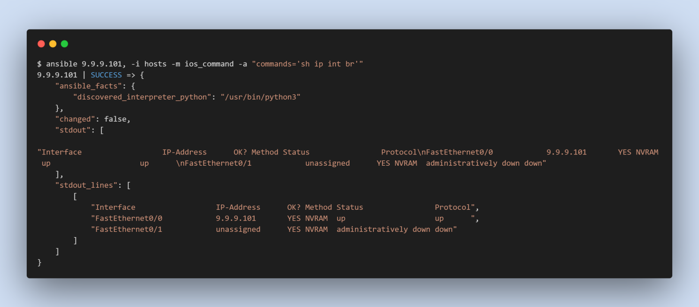

# Ansible Inventory

Ansible is easy to get started with, but before we start using Ansible for network automation, there is a minimum requirement we need to prepare Ansible. That is preparing Ansible configuration and inventory files.

- inventory file - describes devices
- Ansible configuration file setting, to work with network equipment

Inventory file

In the inventory file we add the names or IP of the devices that are to be managed remotely. Devices can be listed one at a time or divided into groups. Preferably use the name of the devices instead of the IP addresses and make sure that these names can be resolved via the DNS server or from the control machine local /etc/hosts (static DNS entries) file.

The file can be described in INI or YAML format. Example files in INI format:

```ini
rtr.example.com

[router]
192.168.10.3
192.168.20.4

[switch]
192.168.30.5
```

The name, which is indicated in square brackets, is the name of the group. In this case, two device groups are created: that is router and switch.

The division into groups must be approached carefully. By default, the inventory file is located in /etc/ansible/hosts. In this case, it is usually better to create your own inventory file and use it. To do this, either specify it when starting ansible using the -i *path* option, or specify the file in the Ansible configuration file.

## Group of groups

Ansible also allows you to combine groups of devices into a common group. A special syntax is used for this:

```ini
[router]
192.168.10.3
192.168.20.4

[switch]
192.168.30.5

[cisco:children]
router
switch
```

## Default groups

By default, Ansible has two groups: all and ungrouped. The first includes all hosts, and the second, respectively, hosts that do not belong to any of the groups.

## Adding Variables

We can store variable values that relate to a specific host or group in inventory file. You may add variables directly to the hosts and groups in your main inventory.

When working with network equipment, you must specify that a network_cli connection should be used. This can be specified in the inventory file, variable files, and so on.

To verify the hosts in your inventory:

```console
$ ansible all --list-hosts
SSH password:
  hosts (3):
    192.168.10.3
    192.168.20.4
    192.168.30.5
```

## Build Inventory for Lab

Now let’s create an inventory hosts file. In the first step we enter the name of devices into group and then add groups to the network group as below:

```ini
[router]
9.9.9.101
9.9.9.102
9.9.9.103

[router:vars]
ansible_user=admin
ansible_password=cisco
ansible_network_os=ios
ansible_connection=network_cli
```

Some of the parameters (variables) can be written to the inventory file and then they will not need to be specified in the ad-hoc command.

Now the ad-hoc command can be called like in the below screenshot:


