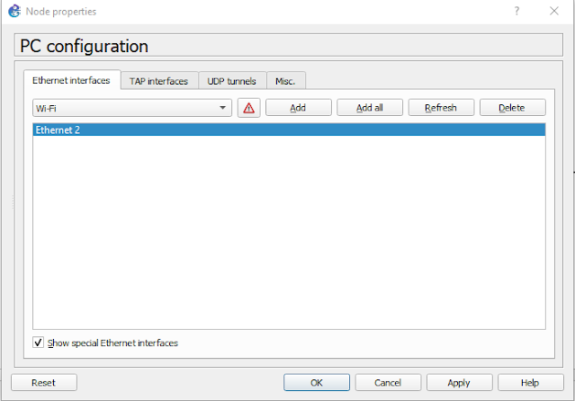
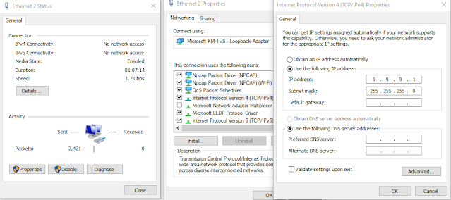
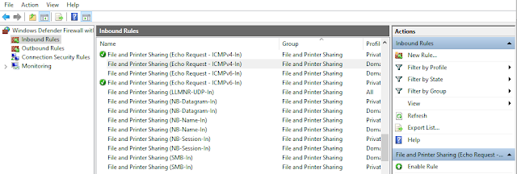
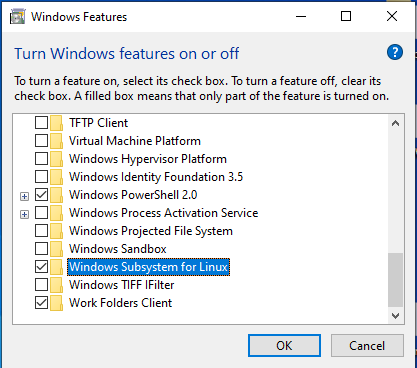

# Ansible GNS3 Lab Setup

In this section, we will set up, lab topology with a Windows machine (on WSL) and GNS3. We are using a Microsoft loop-back adapter for this lab, which simplifies the management of network devices for network automation with GNS3. 

The required steps for this lab are described below:

- GNS3 and VMware
- Download the PuTTY.exe file.
- Install Microsoft loop-back adapter and GNS3 configuration.
- Configuration of the network device.
- Configuration of windows defender firewall.
- WSL-1 (Windows Sub System for Linux).

## Microsoft loop-back adapter Installation

1. Right-click on the window start menu icon and select Device Manager. The device manager window will open.
2. Click on Action, and select Add legacy hardware.
3. Click next on the welcome screen.
4. Choose “Install the hardware that I manually select from a list” and click on Next.
5. Scroll down and select Network adapters from offered common hardware types and click on Next.
6. Select Microsoft as the manufacturer, and then select Microsoft KM-TEST Loop-back adapter card model, click on Next.
7. Click on Next.
8. Click on Finish and identify your loop-back adapter, in my case Ethernet2 as shown below:


## GNS3 and Networking device

Start GNS3 and drop a cloud node at the workspace and configure as below:

1. Right-click Cloud node, select Configure, and then select “Show special Ethernet interfaces”.
2. Add the Ethernet2 (loopback adapter) from the drop-down menu.
3. Delete any other interfaces.
4. Highlight the Ethernet2
5. Click on add button.
6. Apply OK.
7. Change the symbol to a computer and rename the cloud node to PC.



Configure Ethernet2 adapter from opening windows Network and Sharing Center then change adopter setting and add static IP address as below. The IP address used in this example is only for the lab.



Add switch and router as per below topology:


Configure SSH and device IP on SW1 as below:

```console
conf t
!
hostname SW1
!
enable secret cisco
service password-encryption
!
username admin password cisco
!
no ip domain-lookup
!
ip domain name tech.com
!
crypto key generate rsa general-keys modulus 2048       
!
interface Vlan1
 ip address 9.9.9.10 255.255.255.0
 no shutdown
!
line vty 0 4
 logging synchronous
login local
 transport input all
!
end
!
Wr
```

Also configure routers as per the above network topology.

## Windows defender firewall setting

- Open cmd.exe and check connectivity with ping, hope all is well.
- You can open the Windows Defender firewall as shown.
- Open Windows defender firewall with Advanced Security and enable these two settings on the inbound rules as below.



- File and Printer Sharing (Echo Request – ICMPv4-In) Private
- File and Printer Sharing (Echo Request – ICMPv6-In) Private

This will allows GNS3 to send back ICMP (ping) requests to the host PC.

## WSL-1 Installation

For downloading and installation of Windows Subsystem for Linux on Windows 10 simply follow these steps:

- Step 1:- Enable the Windows Subsystem for Linux feature. This step needs administrative privileges.

    1. Right-click on the Windows Start menu icon, choose Search and type "Windows Features". Select the top entry (Turn Windows features on or off) to enable or turn off Windows-Features. The Windows-Features dialog will be opened.

    2. Select in the upcoming dialog the check box for Windows Subsystem for Linux from the bottom of the list and press the OK button. Applying the changes may take a few minutes. Finally, press the Restart now button to reboot the computer.



Open the Start menu and select Microsoft Store and download Ubuntu (WSL). After installing WSL open WSL terminal and ping the above lab.
